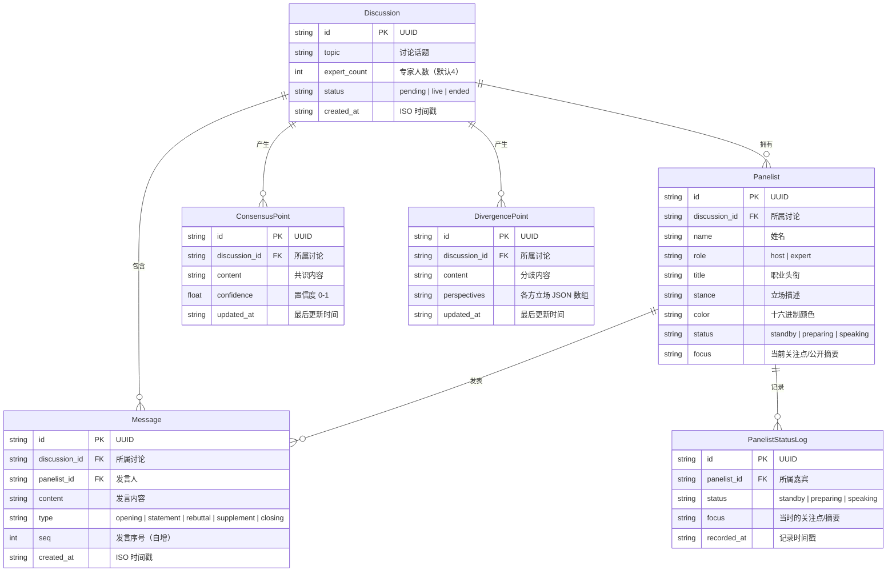

# 数据库 ER 图

## 实体关系图



## 表结构 SQL

```sql
CREATE TABLE discussions (
    id TEXT PRIMARY KEY,
    topic TEXT NOT NULL,
    expert_count INTEGER NOT NULL DEFAULT 4,
    status TEXT NOT NULL DEFAULT 'pending' CHECK(status IN ('pending','live','ended')),
    created_at TEXT NOT NULL DEFAULT (datetime('now'))
);

CREATE TABLE panelists (
    id TEXT PRIMARY KEY,
    discussion_id TEXT NOT NULL REFERENCES discussions(id) ON DELETE CASCADE,
    name TEXT NOT NULL,
    role TEXT NOT NULL CHECK(role IN ('host','expert')),
    title TEXT NOT NULL,
    stance TEXT NOT NULL,
    color TEXT NOT NULL,
    status TEXT NOT NULL DEFAULT 'standby' CHECK(status IN ('standby','preparing','speaking')),
    focus TEXT
);

CREATE TABLE messages (
    id TEXT PRIMARY KEY,
    discussion_id TEXT NOT NULL REFERENCES discussions(id) ON DELETE CASCADE,
    panelist_id TEXT NOT NULL REFERENCES panelists(id) ON DELETE CASCADE,
    content TEXT NOT NULL,
    type TEXT NOT NULL CHECK(type IN ('opening','statement','rebuttal','supplement','closing')),
    seq INTEGER NOT NULL,
    created_at TEXT NOT NULL DEFAULT (datetime('now'))
);

CREATE TABLE consensus_points (
    id TEXT PRIMARY KEY,
    discussion_id TEXT NOT NULL REFERENCES discussions(id) ON DELETE CASCADE,
    content TEXT NOT NULL,
    confidence REAL NOT NULL DEFAULT 0.5 CHECK(confidence >= 0 AND confidence <= 1),
    updated_at TEXT NOT NULL DEFAULT (datetime('now'))
);

CREATE TABLE divergence_points (
    id TEXT PRIMARY KEY,
    discussion_id TEXT NOT NULL REFERENCES discussions(id) ON DELETE CASCADE,
    content TEXT NOT NULL,
    perspectives TEXT NOT NULL DEFAULT '[]',
    updated_at TEXT NOT NULL DEFAULT (datetime('now'))
);

CREATE TABLE panelist_status_logs (
    id TEXT PRIMARY KEY,
    panelist_id TEXT NOT NULL REFERENCES panelists(id) ON DELETE CASCADE,
    status TEXT NOT NULL CHECK(status IN ('standby','preparing','speaking')),
    focus TEXT,
    recorded_at TEXT NOT NULL DEFAULT (datetime('now'))
);

-- 索引
CREATE INDEX idx_panelists_discussion ON panelists(discussion_id);
CREATE INDEX idx_messages_discussion ON messages(discussion_id, seq);
CREATE INDEX idx_consensus_discussion ON consensus_points(discussion_id);
CREATE INDEX idx_divergence_discussion ON divergence_points(discussion_id);
CREATE INDEX idx_status_logs_panelist ON panelist_status_logs(panelist_id, recorded_at);
```
